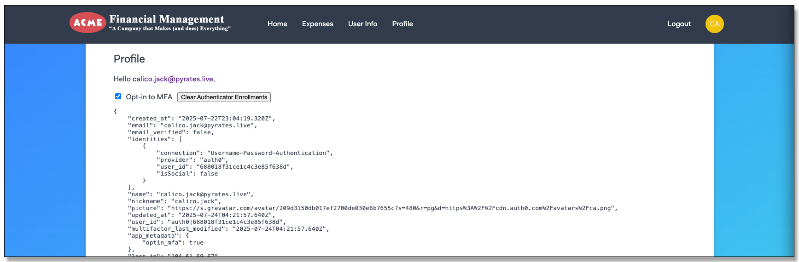
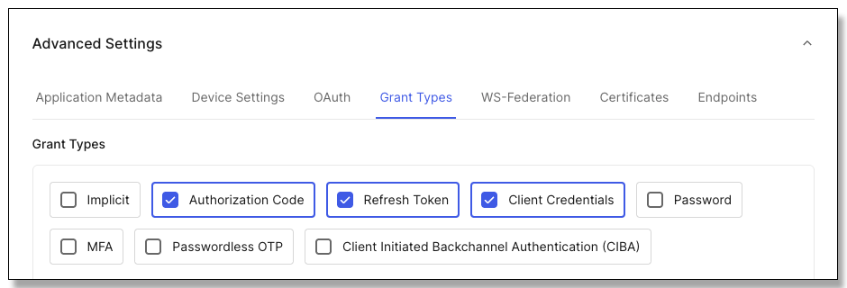
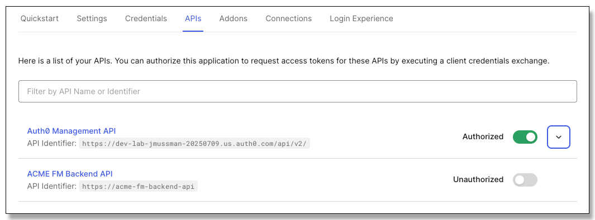
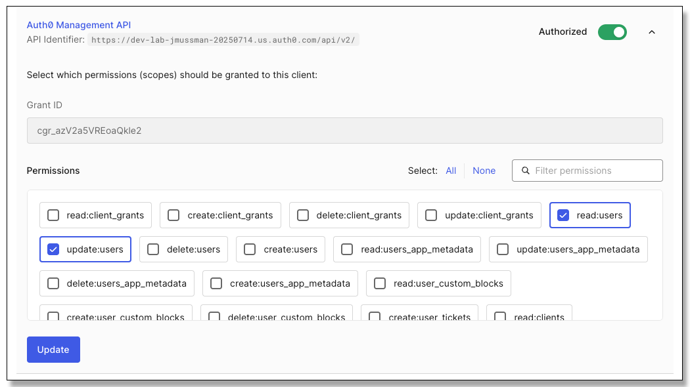

# Lab: Management API

## Preface

Visit the [Auth0-Application-Development](https://github.com/auth0-sandbox/auth0-application-development) repository for the general
lab instructions and the sequential list of the labs in this series.
The work will be completed in the *Lab* folder; the *Solution* folder contains the completed solution sans the .env configurations.

## Dependencies

* The Auth0 ACME Financial Management client configuration
* The Auth0 ACME FM Backend API configuration
* If you relaunch this lab in a new GitHub Codespace remember to update the callback URLs in the Auth0 client configuration.

## Synopsis

Add the functionality for the application to read and alter the user profile.
This requires issuing a machine-to-machine (M2M) access token with access to the Management API.
Since this is the only way to gain access and write the user profile, the application must be a hybrid
that acts as the guard to make sure the correct user is the only one affected.

The server-side of the Acme FM application must be implemented.
This page and the required browser functionality to set the app_metadata and clear the
enrolled authenticators has already been added to the client-side:

<div style="text-align: center"></div>

## Part 1: Link the application integration to the Management API

1. In the Auth0 tenant locate the settings for the *ACME Financial Management* application:
    *Applications &rarr; Applications, Acme Financial Management, Settings*.

1. Scroll down the page and click *Advanced Settings*.
    Select *Client Credentials* if it is not already selected, and click the *Save* button at
    the bottom of the page:

    <div style="text-align: center"></div>

    NOTE: This enables the application to use one client ID to both act on the user's behalf and get an access token
    for the backend API, and act on its own behalf and get an M2M client token for the Auth0 Management API.
    A *hybrid application.*

1. At the top of the page move select the *APIs* tab and enable the *Auth0 Management API*:

    <div style="text-align: center"></div>

    NOTE: This section of the application integration is only used for APIs the application will establish
    a machine-to-machine connection with on its own behalf.
    It has no bearing on issuing access tokens to act on the user's behalf through the Authorization Code
    Grant flow.

1. Expand the *Auth0 Management API* section with the dropdown button at the right.
    The Management API has a significant number of permissions defined.
    Use the *Filter Permissions* search box to find and enable *read:users*, *update:users*,
    and *delete:guardian_enrollments*.
    Click the *Update* button when all three are selected:

    <div style="text-align: center"></div>

## Part 2: Configure the backend API

1. Right-click the "Lab/API" folder and open in the integrated terminal.

1. Run *npm install* to install the dependency packages:
    ```bash
    $ npm install
    ```

1. Right-click the "Lab/API/.env" file and open to the right:
    ```
    AUDIENCE=https://acme-fm-backend-api
    ISSUER=
    JWKS_URI=
    PORT=38500
    ```

1. In the Auth0 tenant use the sidebar to navigate to *Applications &rarr; Applications* and
choose the *ACME Financial Management* application.

1. At the bottom of the settings page, expand *Advanced Settings*, and click on the *Endpoints* tab.

1. Locate the entry for *JSON Web Key Set* and copy the value.

1. In VS Code, in the .env file in the editor, set the *JWKS_URI* to the value copied from the tenant.

1. Set the *ISSUER* to the URL of your Auth0 tenant: *https://\<your domain>.\<your region>.auth0.com/*.
That happens to be the first part of the JWKS_URI value, up to and including
the / in front of the path part of the URL, so you can get it from there.
Make sure the trailing slash is present, because the access token *iss* claim will have it and the
API needs to match what is sent exactly.

1. Save and close the .env file.

## Part 3: Add support for the Management API access token

1. Right-click the "Lab/Acme/.env" file and open to the right:
    ```
    BACKEND_AUDIENCE=https://acme-fm-backend-api
    BACKEND_URL=http://localhost:38500
    CLIENT_ID=
    CLIENT_SECRET=
    DOMAIN=
    PORT=37500
    SECRET="a long, randomly-generated string stored in env"
    ```

1. Set the *CLIENT_ID*, *CLIENT_SECRET*, and *DOMAIN* variables from the Auth0 tenant
    *ACME Financial Management* application.

1. Save and close the .env file.

1. Right-click the "Lab/Acme" folder and open in the integrated terminal.

1. Run *npm install* to install the dependency packages:
    ```bash
    $ npm install
    ```

1. Use npm to add the Auth0 library to the Acme application:
    ```bash
    $ npm install auth0
    ```

1. Find and double-click the "Lab/Acme/src/server.js" file to open it.
    It should open on the right editor panel because that has the focus, but you can always
    drag it to that panel if it opens on the left.

1. At the top of server.js file add an import to get the ManagementClient class:
    ```js
    import { ManagementClient } from 'auth0'
    ```

1. Locate the comment in the code that says:
    ```js
    // Insert the Management API code here.
    ```

1. Replace the comment with the statement that creates an instance of the *ManagementClient*:
    ```js
    const auth0ManagementClient = new ManagementClient({
        domain: process.env.DOMAIN,
        clientId: process.env.CLIENT_ID,
        clientSecret: process.env.CLIENT_SECRET,
        scope: "read:users update:users delete:guardian_enrollments",
    })
    ```

1. Add the endpoint registration that returns the profile data as JSON, retrieving it using
    the *ManagementClient*.
    Clicking the *Profile* menu link will land on this page:
    ```js
    app.get("/profile", async (req, res) => {
        const locals = { user: req.oidc && req.oidc.user, userinfo: null }
        try {
            if (locals.user) {
                const response = await auth0ManagementClient.users.get(
                    { id: req.oidc.idTokenClaims?.sub, })
                locals.profile = response.data
            }
        } catch (error) {
            console.log(error)
        }
        res.render("profile", locals)
    })
    ```
    
    NOTE: the locals object is the data context passed to the Pug page *profile*.
    Pug merges the data with the page template.

    In the try...catch block the ManagementClient is used to retrieve the user
    profile.
    The application is the guardian; there is no mechanism for choosing a client profile
    to get, the currently logged-in user is always chosen.

1. Add the endpoint registration that is called by the page to change the value of the
    *app_metadata.optin_mfa* profile attribute:
    ```js
    app.post("/profile/app_metadata/optin_mfa", async (req, res) => {
        try {
            if (req.oidc && req.oidc.user) {
                const response = await auth0ManagementClient.users.update(
                    { id: req.oidc.idTokenClaims?.sub },
                    { app_metadata: { optin_mfa: !!req.body.optin_mfa } }
                )
            }
        } catch (error) {
            console.log(error)
        }
        res.redirect('/profile')
    })
    ```

    NOTE: This endpoint updates the profile property, and then redirects back to the profile page.

1. Finally, add the endpoint registration that hte page will call to clear all
    guardian enrollments for the user:
    ```js
    app.post("/profile/authenticators/clear", async (req, res) => {
        try {
            if (req.oidc && req.oidc.user) {
                const response = await auth0ManagementClient.users
                    .deleteAllAuthenticators({ id: req.oidc.idTokenClaims?.sub }
                )
            }
        } catch (error) {
            console.log(error)
        }
        res.redirect('/profile')
    })
    ```

    NOTE: *deleteAllAuthenticators* removes the enrollment for all authenticators
    from the user.

## Part 4: Run the application

1.  *ONLY* for a GitHub Codespace:<br>
    Warning: the URL will change if you are start a new Codespace for Lab, check the
    application URL against the callback and *logout* URLs in the Auth0 ACME Financial
    Management application.

1. In the Run/Debug panel select the run configuration "Launch All" and launch both the
    Acme FM application and the back-end API.

1. Locate the *DEBUG CONSOLE* in the lower VS Code panel.

1. At the top right of the *DEBUG CONSOLE* in the bottom panel look for the dropdown list that
    shows the launch configuration.
    Make sure *Launch ACME FM* is selected.

1. Find the line where the application prints it is started in the *DEBUG CONSOLE*.
    Look at the link it prints out (your link may be different).
    Use the link to launch the Acme application in the browser:
    ```
    The Acme Financial Management application has started, use ctrl/cmd-click to follow this link: http://localhost:37500
    ```

1. Log in as the user you are created and are using for the labs.

1. Click on the *Profile* link to visit the profile page, it will display the full user profile.

1. Click the checkbox to trigger a call to the */profile/app_metadata/optin_mfa* endpoint.
    Verify that the *app_metadata.optin_mfa property changes with each click of the checkbox,
    and it tracks with the checkbox.

1. Click the *Clear Authenticator Enrollments* button that lands on the
    */profile/authenticators/clear* endpoint.
    Verify that the *guardians* array clear out or disappears, and the timestamp
    *multifactor_last_modified* updates to the current time.

1. Sign out of the Acme application.

1. Terminate both applications in Run/Debug.

<br>
Congratulations, you have completed this lab!
If you are performing development inside a GitHub Codespace you may close and delete the Codespace if you no longer need it.
If you are inside a Docker Container, you may delete the docker container.